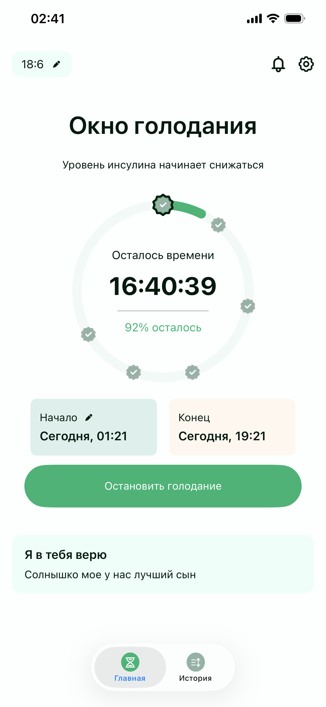
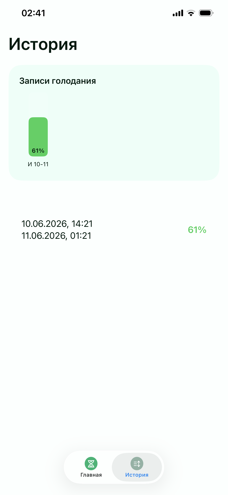

# FiruzaAPP
SwiftUI-based fasting and health tracking application

# Firuza — Intermittent Fasting Tracker

**Firuza** is a personalized intermittent fasting tracker iOS application built as a dedicated project for my wife. The app is designed with a focus on clean UI/UX, precision, and emotional motivation. Unlike generic fasting apps, Firuza is tailored with specific features, behaviors, and technologies chosen to provide a smooth and meaningful user experience.

---

## 💡 Purpose of the App

The idea behind this app was to create a **custom fasting tracker** with full control over functionality and design. It includes precise timing logic, progress visualization, history tracking, and motivational messages sent directly through Firebase.

---

## ⏱️ Key Features

### 🕒 Fasting Timer
- Real-time fasting countdown
- Remaining time display
- Elapsed time tracking
- Progress shown in percentage
- Tap interaction to switch between:
  - Remaining time
  - Elapsed time
  - Percentage view

---

### 📊 Fasting Plans
Supports multiple intermittent fasting modes:
- 20:4
- 18:6
- 16:8
- 14:10
- 12:12

Each plan dynamically adjusts the timer and progress logic.

---

### 📈 History Tracking
- Full fasting session history
- Card-based UI with progress visualization
- Start and end date display
- Progress bar with visual feedback:
  - 🟢 Green: 50% or more completed
  - 🔴 Red: less than 50% completed
- Detailed history list view for all sessions

---

### 💌 Motivational Messages (Firebase)
A unique feature where motivational messages are sent via **Firebase**:
- Title + message structure
- Delivered as notifications
- Designed to support and motivate the user during fasting

---

## 🧱 Architecture & Technologies

This project is built using modern iOS development practices:

- **SwiftUI** — Modern declarative UI framework
- **MVVM Architecture** — Clean separation of logic and UI
- **Firebase** — Remote messaging and backend support
- **CoreData** — Local persistence for fasting history and sessions

---

## 🎨 UI/UX Design

- Minimal and modern interface
- Circular fasting progress ring
- Smooth state transitions
- Clear visual feedback for progress tracking
- Focus on emotional motivation and simplicity

---

## 📱 Screenshots

> Add your screenshots here

- Home Screen (Main Timer View)
- 
- History Screen
- 
- App Icon / Home Screen Integration
- 

---

## ❤️ Personal Story

This application was created as a personal project for my wife, **Firuza**, to provide a dedicated and meaningful fasting experience. The goal was not only to build a functional app, but also to make it emotionally engaging and supportive during daily fasting routines.

---

## 🚀 Future Improvements

- Apple Health integration
- Widgets for home screen
- Cloud sync improvements
- More analytics for fasting behavior

---

## 🛠️ Author

Built with love by **Jabrayil Gulamzada**  
UI/UX Designer & iOS Developer
